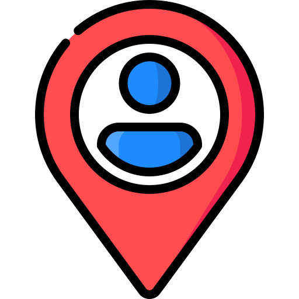

# WHOS THERE

## Description
This application allows tennis players to find an empty tennis court quick!

Application deployed on Heroku: https://whos-there-kkc.herokuapp.com/

## Table of Contents
* [Installation](#installation)
* [Usage](#usage)
* [Responsive Design](#responsive-design)
* [Gif Demo](#gif-demo)
* [Code Snippets](#code-snippets)
* [Credits](#credits)
* [Contributors](#contributors)
* [License](#license)

## Installation
Installation is not required for this application. 

## Usage
The following will be a guide about using the application
- When page loads, a google map screen should be presented with some markers 

- The existing markers represent users' current location
- Users can search a tennis court using the search bar
- Users can place a marker to show other people who are viewing the map about where and which tennis court they are currently using

- Users' markers will only be saved if they have logged into their account
- Users can remove their markers/icons when they are done using a tennis court
- Users can locate their current address by clicking this icon 
</img>

## Responsive Design

## Gif Demo

🔎 Search a location 

📌 Drop a marker

📍 Find my current location

🗺️ Google Maps API functions

## Code Snippets

## Credits

|  Technologies|Front-end|Back-end|
| -|-:| -:|
||||
||||
|||
||||
||||
|||

| 📚 APIs Used|
| :------------- |
| Maps JavaScript API|
| Geocoding API|
| Places API|

|  📒 Libraries|
| :------------- |
| use-places-autocomplete | 
| date-fns|
| @reach/combbox|

## Contributors
* Kristy Guo [LinkedIn](www.linkedin.com/in/kristixxg) | [GitHub](https://github.com/kristixxg)

* Keerti Chaudhary [LinkedIn](https://www.linkedin.com/in/keerti-chaudhary-25331791/) | [GitHub](https://github.com/17keerti)

* Christian Tellez [LinkedIn](https://www.linkedin.com/in/) | [GitHub](https://github.com/)

## License

Copyright (c) 2022 Kristy Guo & Keerti Chaudhary & Christian Tellez

Permission is hereby granted, free of charge, to any person obtaining a copy
of this software and associated documentation files (the "Software"), to deal
in the Software without restriction, including without limitation the rights
to use, copy, modify, merge, publish, distribute, sublicense, and/or sell
copies of the Software, and to permit persons to whom the Software is
furnished to do so, subject to the following conditions:

The above copyright notice and this permission notice shall be included in all
copies or substantial portions of the Software.

THE SOFTWARE IS PROVIDED "AS IS", WITHOUT WARRANTY OF ANY KIND, EXPRESS OR
IMPLIED, INCLUDING BUT NOT LIMITED TO THE WARRANTIES OF MERCHANTABILITY,
FITNESS FOR A PARTICULAR PURPOSE AND NONINFRINGEMENT. IN NO EVENT SHALL THE
AUTHORS OR COPYRIGHT HOLDERS BE LIABLE FOR ANY CLAIM, DAMAGES OR OTHER
LIABILITY, WHETHER IN AN ACTION OF CONTRACT, TORT OR OTHERWISE, ARISING FROM,
OUT OF OR IN CONNECTION WITH THE SOFTWARE OR THE USE OR OTHER DEALINGS IN THE
SOFTWARE.

